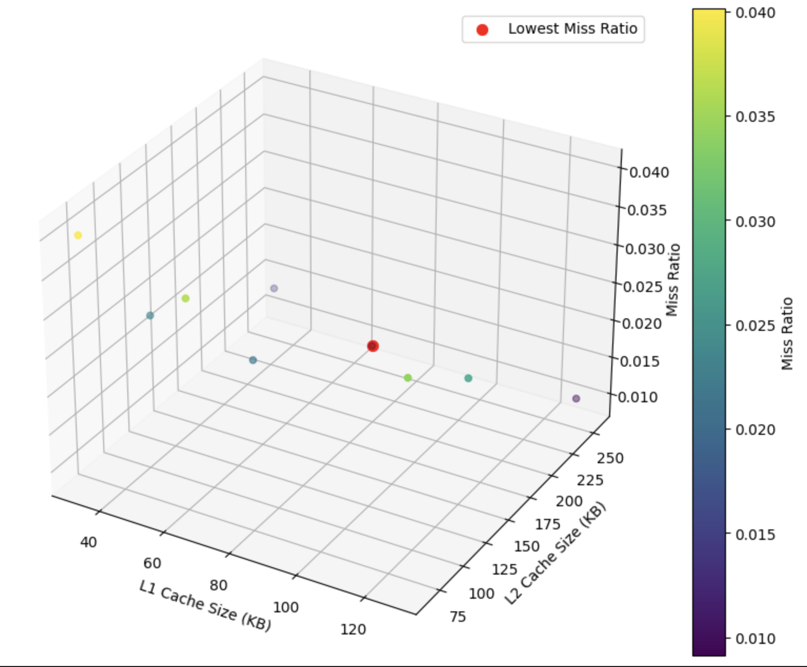

# Question 3

- ```eval.sh``` outputs the specified different cache configurations. outputs were manually executed and Cachegrind_anotate was used to analyze the files one by one. The relevant outputs have been stored and visualized in vis.ipynb. 

- Commands run were: 
```
valgrind --tool=cachegrind --I1=32768,512,64 --D1=32768,512,64 --LL=65536,1024,64 ./3
valgrind --tool=cachegrind --I1=32768,512,64 --D1=32768,512,64 --LL=131072,2048,64 ./3
valgrind --tool=cachegrind --I1=32768,512,64 --D1=32768,512,64 --LL=262144,4096,64 ./3
valgrind --tool=cachegrind --I1=65536,1024,64 --D1=65536,1024,64 --LL=65536,1024,64 ./3
valgrind --tool=cachegrind --I1=65536,1024,64 --D1=65536,1024,64 --LL=131072,2048,64 ./3
valgrind --tool=cachegrind --I1=65536,1024,64 --D1=65536,1024,64 --LL=262144,4096,64 ./3
valgrind --tool=cachegrind --I1=131072,2048,64 --D1=131072,2048,64 --LL=65536,1024,64 ./3
valgrind --tool=cachegrind --I1=131072,2048,64 --D1=131072,2048,64 --LL=131072,2048,64 ./3
valgrind --tool=cachegrind --I1=131072,2048,64 --D1=131072,2048,64 --LL=262144,4096,64 ./3
```

The plotted graph reveals that the  optimal configuration is L1 : 64 KB and L2 L 256 KB. 



